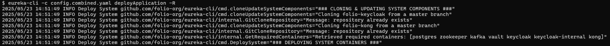
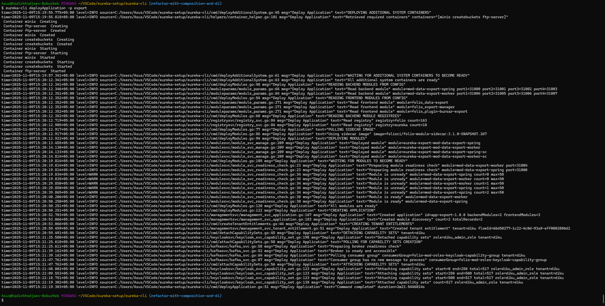
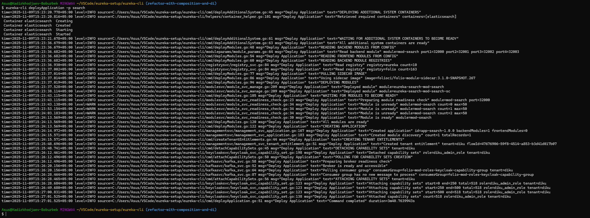
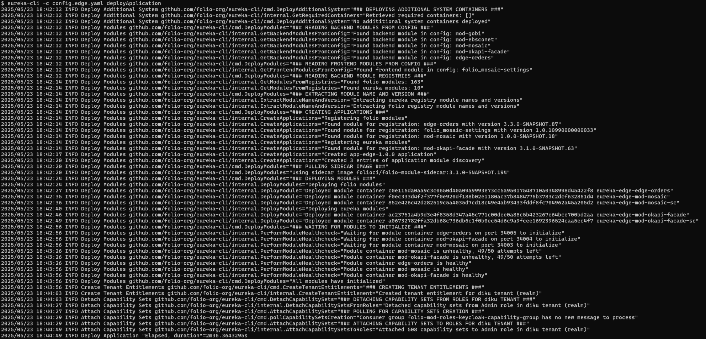
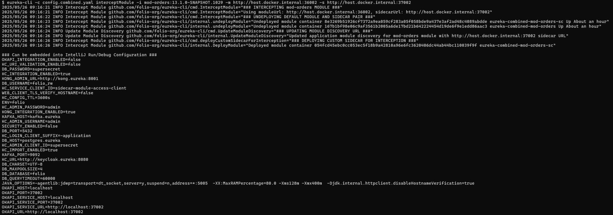
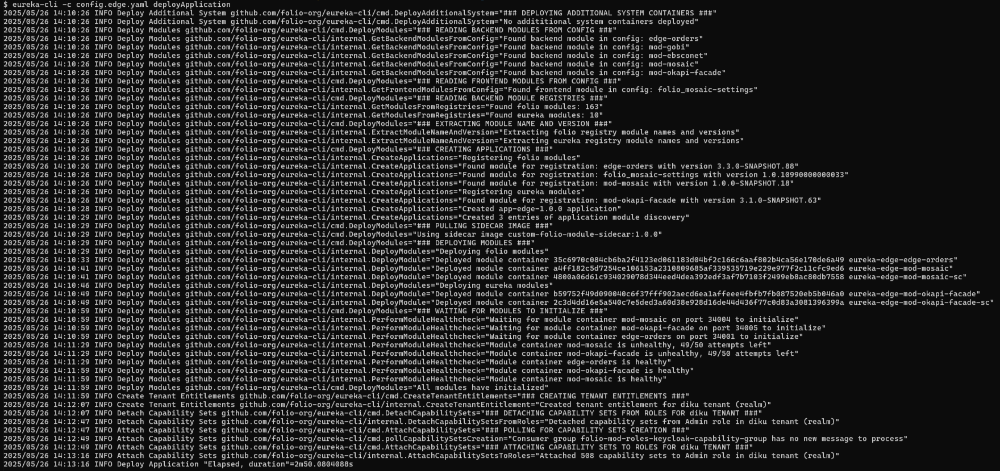
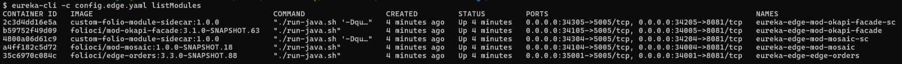
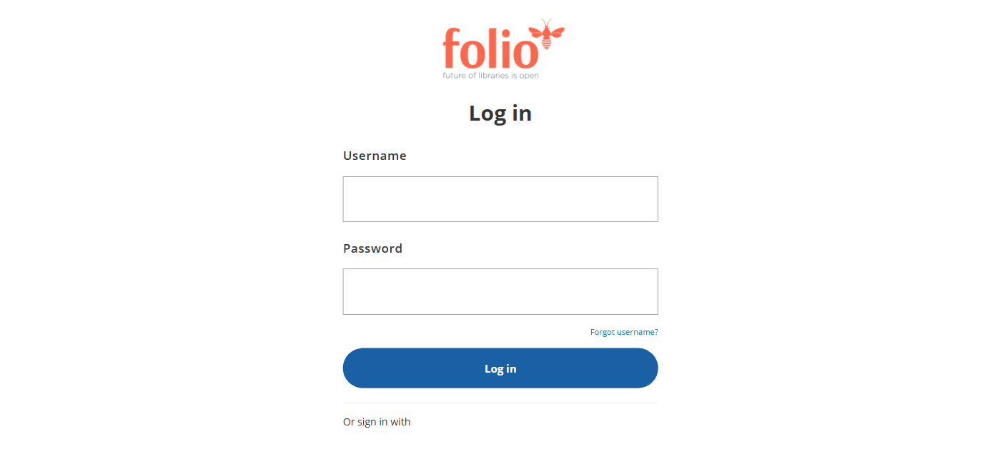
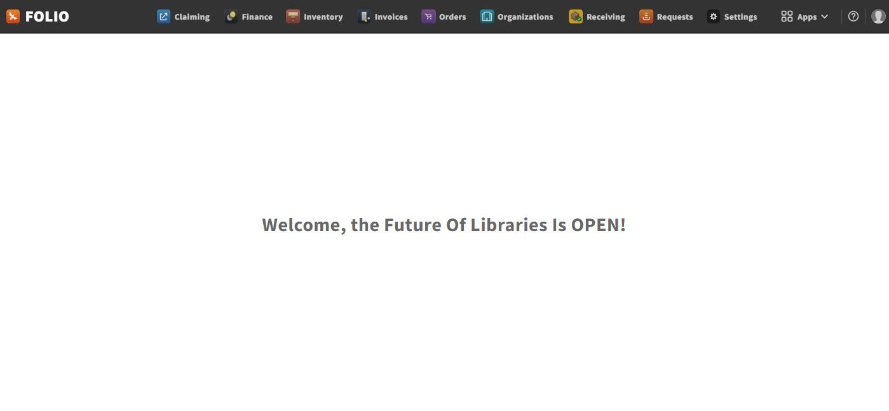

# Eureka CLI

## Purpose

- A CLI to deploy local Eureka development environment

## Prerequisites

- Install dependencies:
  - [Go](https://go.dev/doc/install) compiler: last development-tested version is `go1.24.1 windows/amd64`
  - [Rancher Desktop](https://rancherdesktop.io/) container daemon: last development-tested version is `v1.16.0` (make sure to enable **dockerd (Moby)** container engine)
- Configure hosts:
  - Add `127.0.0.1 keycloak.eureka` entry to `/etc/hosts`
  - Add `127.0.0.1 kafka.eureka` entry to `/etc/hosts`
- Monitor using system components:
  - [Keycloak](http://keycloak.eureka:8080) Admin Console: admin/admin
  - [Vault](http://localhost:8200) UI: Find a Vault root token in the container logs using `docker logs vault` or use `getVaultRootToken` command
  - [Kafka](http://localhost:9080) UI: No auth
  - [Kong](http://localhost:8002) Admin GUI: No auth
  - [MinIO](http://localhost:9001) Console: minioadmin/minioadmin
  - [Kibana](http://localhost:15601) UI: No auth

## Commands

### Build a binary

```shell
mkdir -p ./bin
env GOOS=windows GOARCH=amd64 go build -o ./bin/ .
```

> See docs/BUILD.md to build a platform-specific binary

### (Optional) Install binary

- After building and installing, the binary can be used from any directory

```shell
go install
eureka-cli -c ./config.combined.yaml deployApplication
```

> If you wish to avoid the binary installation please use the relative path of the CLI binary, e.g. `./bin/eureka-cli` with the correct path to the config

### (Optional) Enable autocompletion

- Command autocompletion can be enabled in the shell of your choice, below is an example for the **Bash** shell (`.bash_profile` is preferred on Windows because it is auto-sourced)

```bash
go install
echo "source <(eureka-cli completion bash)" >> ~/.bash_profile
source ~/.bash_profile
```

> Type the command partially and hit TAB to see the available command suggestions or full command autocomplete

### Deploy the combined application

- By default, it will use public images available in DockerHub (folioci & folioorg namespaces)
- Use a specific profile, options: [combined, export, search, edge]: `-p` or `--profile`
- Use a specific config file: `-c` or `--configFile`
- Overwrite files in .eureka home directory: `-o` or `--overwriteFiles`
- Enable debug: `-d` or `--enableDebug`
- Use only required system containers: `-R` or `--onlyRequired`
- Build Docker images: `-b` or `--buildImages`
- Update Git cloned projects: `-u` or `--updateCloned`

```shell
eureka-cli -c ./config.combined.yaml deployApplication
```

- Use the debug `-d` flag to troubleshoot your environment deployment to see how the CLI interacts with **Kong** via HTTP

```shell
eureka-cli -c ./config.combined.yaml deployApplication -d
```

- If you are resource constrained, the CLI also supports deploying the environment with only required system containers with `-R`

```shell
eureka-cli -c ./config.combined.yaml deployApplication -R
```

- The profile `-p` flag eliminates the need to define a config file path by relying on the default configs that are automatically created in `.eureka` home directory

```bash
eureka-cli -p combined deployApplication
```

> Available configs are: _combined_, _export_, _search_ and _edge_

- It can be combined with the `-o` flag to overwrite all existing files in `.eureka` home directory to receive changes from the upstream

```bash
eureka-cli -p combined -o deployApplication
```



> Deploys the system without optional containers depending on the profile, such as _netcat_, _kafka-ui_, _minio_, _createbuckets_, _elasticsearch_, _kibana_ and _ftp-server_

- In case you want to update your local repositories of _folio-kong_, _folio-keycloak_ and _platform-complete_ (UI), you can do so with the combined `-bu` flags

```shell
eureka-cli -c ./config.combined.yaml deployApplication -bu
```

> This will update the cloned projects and force-build Docker images locally before deploying the environment

### Undeploy the combined application

```shell
eureka-cli -c ./config.combined.yaml undeployApplication
```

### Deploy the combined application from AWS ECR

To use AWS ECR as your container registry rather than the public Folio DockerHub, set `AWS_ECR_FOLIO_REPO` in your environment. When this env variable is defined it is assumed that this repository is private and you have also defined credentials in your environment. The value of this variable should be the URL of your repository.

- Set AWS credentials explicitly

```shell
export AWS_ACCESS_KEY_ID=<access_key>
export AWS_SECRET_ACCESS_KEY=<secret_key>
export AWS_ECR_FOLIO_REPO=<repository_url>
eureka-cli -c ./config.combined.yaml deployApplication
```

- Reuse stored AWS credentials found in `~/.aws/config`

```shell
export AWS_ECR_FOLIO_REPO=<repository_url>
AWS_SDK_LOAD_CONFIG=true eureka-cli -c ./config.combined.yaml deployApplication
```

> See docs/AWS_CLI.md to prepare AWS CLI beforehand

### Deploy child applications

The CLI also supports deploying child applications on top of the existing one. The command used is `deployApplication` that behaves differently when `application.dependencies` is being set in the config file.

#### Deploy the export application

- This application contains modules and system containers required for data export functionality that relies on MinIO and FTP

```shell
eureka-cli -c ./config.export.yaml deployApplication
```



#### Deploy the search application

- The search application provides Elastic search capability as required by the Inventory App and for the ECS setup to work

```shell
eureka-cli -c ./config.search.yaml deployApplication
```



#### Deploy the edge application

- Edge application provides modules with an included mod-okapi-facade to work with the Edge API, Karate tests, or with Mosaic integration

```shell
eureka-cli -c ./config.edge.yaml deployApplication
```



### Undeploy child applications

- All child applications can be undeployed with the same `undeployApplication` command, which will remove both the modules and system containers used by the app

```shell
eureka-cli -c ./config.{{app}}.yaml undeployApplication
```

> Replace `{{app}}` with either of the supported profiles: _export_, _search_ or _edge_

### Other commands

The CLI also contains other useful commands to aid with developer productivity. The most important ones that can be used independently are outlined below:

- Lists deployed system containers

```bash
eureka-cli listSystem
```

- List deployed modules

```bash
# Using the current profile
eureka-cli -c config.combined.yaml listModules

# For a particular module and its sidecar in a profile
eureka-cli -c config.combined.yaml listModules -m mod-orders

# For only modules in a profile
eureka-cli -c config.combined.yaml listModules -M module

# For only sidecars in a profile
eureka-cli -c config.combined.yaml listModules -M sidecar

# For only management modules
eureka-cli -c config.combined.yaml listModules -M management

# Using all modules for all profiles including mgr-*
eureka-cli -c config.combined.yaml listModules -a
```

- List the available module versions in the registry or fetch a specific module descriptor by version

```bash
# List versions for a module
eureka-cli listModuleVersions -m edge-orders

# Get module descriptor for a particular version
eureka-cli listModuleVersions -m edge-orders -i edge-orders-3.3.0-SNAPSHOT.88
```

- Get current Vault Root Token used by the modules

```bash
eureka-cli getVaultRootToken
```

- Get Keycloak Access Token for a tenant

```bash
eureka-cli getKeycloakAccessToken -t diku
```

- Get an Edge API key for a user and tenant

```bash
eureka-cli -c config.edge.yaml getEdgeApiKey -t diku -U diku_admin
```

- Check if module internal ports are accessible

```bash
eureka-cli checkPorts
```


> The CLI also exposes an internal port 5005 for all modules and sidecars that can be used for remote debugging in IntelliJ

- Intercept a module gateway service in Kong to reroute traffic from the environment to an instance started in IntelliJ

```bash
# Using mod-orders and custom module and sidecar gateway URLs
eureka-cli -c config.combined.yaml interceptModule -i mod-orders:13.1.0-SNAPSHOT.1029 -m http://host.docker.internal:36002 -s http://host.docker.internal:37002

# Using mod-orders and default module and sidecar gateway URLs with only ports specified
# will substitute 36002 for http://host.docker.internal:36002 and 37002 for http://host.docker.internal:37002 internally for Windows and MacOS
# or http://172.17.0.1:36002 and http://172.17.0.1:37002 respectively for Linux or specify `application.gateway-hostname` explicitly in the config
eureka-cli -c config.combined.yaml interceptModule -i mod-orders:13.1.0-SNAPSHOT.1029 -g -m 36002 -s 37002

# To restore both the module and sidecar in the environment as before the gateway service interception
eureka-cli -c config.combined.yaml interceptModule -i mod-orders:13.1.0-SNAPSHOT.1029 -r
```



> See docs/DEVELOPMENT.md for more information on `interceptModule` command or use `-h` or `--help` flag to see some examples

## Using a custom folio-module-sidecar

If your workflow relies on a custom implementation of _folio-module-sidecar_, the CLI also supports deploying an environment with sidecars using a custom Docker image.

- Git clone **folio-module-sidecar** from GitHub

```bash
git clone https://github.com/folio-org/folio-module-sidecar.git
```

- Apply your changes locally & build a custom local image

```bash
cd folio-module-sidecar
mvn clean package -DskipTests
docker build --tag custom-folio-module-sidecar:1.0.0 .
```

> This example uses a non-native image build, see <https://github.com/folio-org/folio-module-sidecar/blob/master/README.md> for how to build a native Docker image

- Use the newly built `custom-folio-module-sidecar:1.0.0` local image in your config by replacing `sidecar-module.image` with `sidecar-module.local-image` key

```yaml
sidecar-module:
  local-image: custom-folio-module-sidecar
  version: 1.0.0
```

- Deploy the environment with this config, in our example we deploy an _edge_ application with `custom-folio-module-sidecar:1.0.0` sidecars

```bash
eureka-cli -c config.edge.yaml deployApplication
```



- Check the sidecar image version after application deployment

```bash
eureka-cli -c config.edge.yaml listModules
```



## Using the UI

The environment depends on [platform-complete](https://github.com/folio-org/platform-complete) project to correlate and assemble frontend and backend modules into a single UI package. The CLI by default will use a pre-built Docker image of _platform-complete_ stored in the DockerHub to deploy the UI container.

- If there is a need to use a different namespace, override the `namespaces.platform-complete-ui` key in the config, for example in `config.combined.yaml`

```yaml
namespaces:
  platform-complete-ui: bkadirkhodjaev # Change to pull from a different namespace
```

- If you haven't built the image yet, the CLI has a dedicated command to build the UI image separately from the deployment lifecycle

```bash
eureka-cli buildAndPushUi -n {{namespace}} -t diku -u
```

> Replace {{namespace}} with your DockerHub namespace of choice, and use `-u` flag only if you want to update your local repository with upstream changes

- To use the newly built image, remove the old container and create a new one

```bash
eureka-cli undeployUi
eureka-cli deployUi
```

> This will pull the latest Docker image from the registry and create a UI container out of it

The CLI also supports building and deploying the UI image in-place, during either `deployApplication` execution or with `deployUi` command.

```bash
# Will build and deploy every image including folio-kong, folio-keycloak and platform-complete itself
eureka-cli deployApplication -b -u

# Will only build and deploy the platform-complete image
eureka-cli deployUi -b -u
```

## Using the environment

- Access the UI from `http://localhost:3000` using `diku_admin` username and `admin` password:



- After successful login the UI can be used just as any other Folio application:



- Kong gateway is available at `localhost:8000` and can be used to get an access token directly from the backend:

```shell
# Using diku_admin (admin user)
curl --request POST \
  --url localhost:8000/authn/login-with-expiry \
  --header 'Content-Type: application/json' \
  --header 'X-Okapi-Tenant: diku' \
  --data '{"username":"diku_admin","password": "admin"}' \
  --verbose

# Using diku_user (limited user)
curl --request POST \
  --url localhost:8000/authn/login-with-expiry \
  --header 'Content-Type: application/json' \
  --header 'X-Okapi-Tenant: diku' \
  --data '{"username":"diku_user","password": "user"}' \
  --verbose
```

## Troubleshooting

### General

- If using Rancher Desktop on a system that also uses Docker Desktop, make sure to set `DOCKER_HOST` to point to the correct container daemon, by default `/var/run/docker.sock` will be used

### Command-based

- If during `Deploy System` or `Deploy Ui` shell commands are failing to execute, verify that all shell scripts located under `./misc` folder are saved using the **LF** (Line Feed) line break
- If during `Deploy Management` or `Deploy Modules` the healthchecks are failing, make sure to either define **host.docker.internal** in `/etc/hosts` or set `application.gateway-hostname=172.17.0.1` in the `config.*.yaml`
- If during `Deploy Modules` an exception contains **"Bind for 0.0.0.0:XXXXX failed: port is already allocated."** make sure to set `application.port-start=20000` in the `config.*.yaml`
- If during `Deploy Modules` an exception contains **"Failed to load module descriptor by url: <https://folio-registry.dev.folio.org/_/proxy/modules/mod-XXX>"**, make sure that the module descriptor for this version exists or use an older module version by setting `mod-XXX.version` in the `config.*.yaml`
- If during `Create Tenant Entitlement` an exception contains **"The module is not entitled on tenant ..."**, rerun `undeployApplication` and `deployApplication` once again with more available RAM
