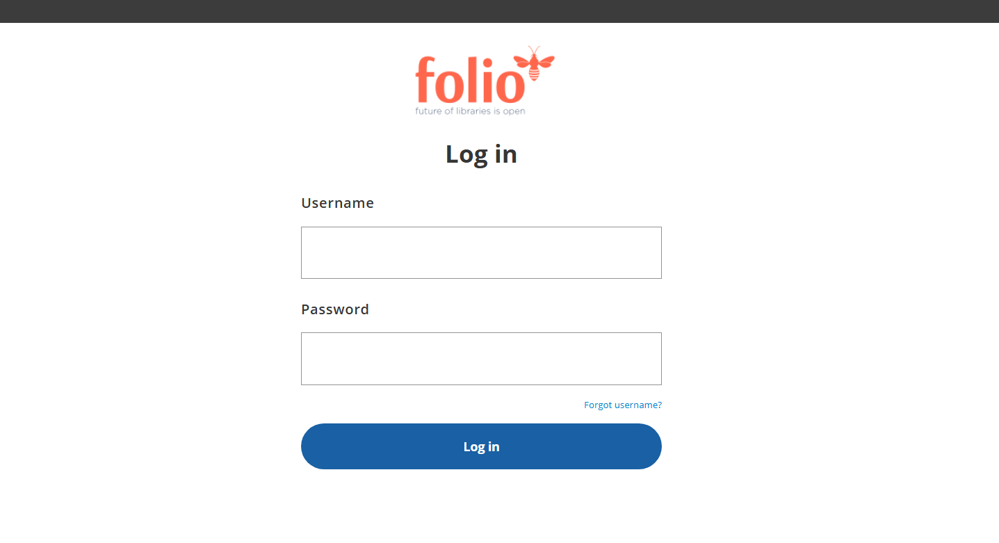

# Eureka CLI

## Purpose

- A CLI to deploy local Eureka development environment

## Commands

### Prerequisites

- Install dependencies:
  - [GO](<https://go.dev/doc/install>) compiler: last development-tested version is `go1.22.4 windows/amd64`
  - [Rancher Desktop](<https://rancherdesktop.io/>) container daemon: last development-tested is `v1.16.0` (make sure to enable **dockerd (Moby)** container engine)
- Configure hosts:
  - Add `127.0.0.1 keycloak.eureka` entry to `/etc/hosts`
  - Add `127.0.0.1 kafka.eureka` entry to `/etc/hosts`
- Monitor using system components:
  - [Keycloak](<http://keycloak.eureka:8080>) Admin Console: admin:admin
  - [Vault](<http://localhost:8200>) UI: Find a Vault root token in the container logs using `docker logs vault` or use `getVaultRootToken` command
  - [Kafka](<http://localhost:9080>) UI: No auth
  - [Kong](<http://localhost:8002>) Admin GUI: No auth  

### Build a binary
  
```shell
mkdir -p ./bin
env GOOS=windows GOARCH=amd64 go build -o ./bin .
```

> See BUILD.md to build a platform-specific binary

### (Optional) Setup a default config in the home folder

- This config will be used by default if `-c` or `--config` flag is not specified

```shell
./bin/eureka-cli.exe setup
```

### (Optional) Install binary

- After building and installing the binary can be used from any directory

```shell
go install
eureka-cli.exe setup
```

### Deploy a minimal platform application

#### Using Public DockerHub container registry (folioci & folioorg namespaces)

- Use a specific config: `-c` or `--config`
- Enable debug: `-d` or `--debug`

```shell
./bin/eureka-cli.exe -c ./config.minimal.yaml deployApplication
```

#### Using Private AWS ECR container registry

To use AWS ECR as your container registry rather than the public Folio DockerHub, set `AWS_ECR_FOLIO_REPO` in your environment. When this env variable is defined it is assumed that this repository is private and you have also defined credentials in your environment. The value of this variable should be the URL of your repository.

- Set AWS credentials explicitly

```shell
export AWS_ACCESS_KEY_ID=<access_key>
export AWS_SECRET_ACCESS_KEY=<secret_key>
export AWS_ECR_FOLIO_REPO=<repository_url> 
./bin/eureka-cli.exe -c ./config.minimal.yaml deployApplication
```

- Reuse stored AWS credentials found in `~/.aws/config`

```shell
export AWS_ECR_FOLIO_REPO=<repository_url>
AWS_SDK_LOAD_CONFIG=true ./bin/eureka-cli.exe -c ./config.minimal.yaml deployApplication
```

> See AWS_CLI_PREPARATIONS.md to prepare AWS CLI beforehand

- Undeploy using:

> ./bin/eureka-cli.exe -c ./config.minimal.yaml undeployApplication

### Use the environment

- Access the UI from `http://localhost:3000` using `diku_admin` username and `admin` password:



- Kong gateway is available at `localhost:8000` and can be used to login and get a token directly from the backend:

```shell
# Using diku_admin (admin user)
curl --request POST \
  --url localhost:8000/authn/login-with-expiry \
  --header 'Content-Type: application/json' \
  --header 'X-Okapi-Tenant: diku' \
  --data '{"username":"diku_admin","password": "admin"}' \
  --verbose

# Using diku_user (limited user)
curl --request POST \
  --url localhost:8000/authn/login-with-expiry \
  --header 'Content-Type: application/json' \
  --header 'X-Okapi-Tenant: diku' \
  --data '{"username":"diku_user","password": "user"}' \
  --verbose
```

### Troubleshooting

- Verify that all shell scripts located under `./misc` folder are saved using the **LF** (Line Feed) line break
- If you get a **SIGKILL** when trying to build the stripes container configure Rancher Desktop or other docker env with more RAM
- If health checks are failing make sure localhost is mapped to host.docker.internal in your `/etc/hosts` file
- If using Rancher Desktop on a system that also uses Docker Desktop, you may need to do set `DOCKER_HOST` in your env to where `docker.sock` is
- During tenant entitlement if a thrown exception contains `The module is not entitled on tenant ...` it is recommended to rerun `deployApplication` again after undeploying the existing one
