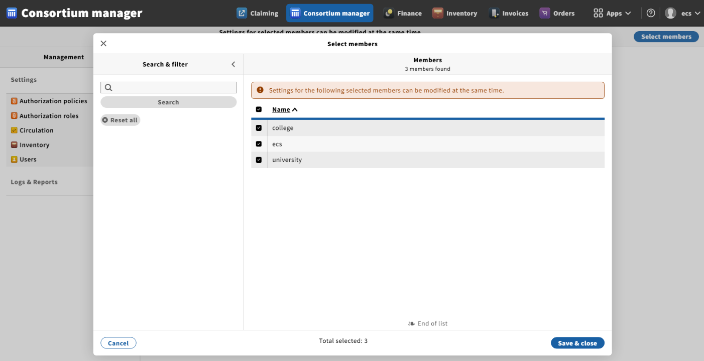
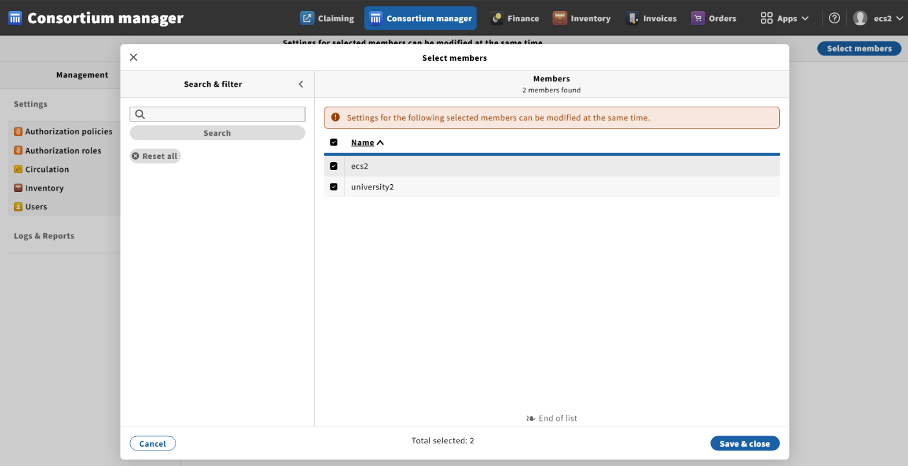

# Eureka CLI

## Purpose

- A CLI to deploy a local Eureka development environment

## Prerequisites

- Install dependencies:
  - [Go](https://go.dev/doc/install) compiler: last development-tested version is `go1.25.1 windows/amd64`
  - [Rancher Desktop](https://rancherdesktop.io/) container daemon: last development-tested version is `v1.19.3`
    - Enable **dockerd (Moby)** container engine
    - Disable **Check for updates automatically**
- Configure hosts:
  - Add `127.0.0.1 postgres.eureka` entry to `/etc/hosts`
  - Add `127.0.0.1 kafka.eureka` entry to `/etc/hosts`
  - Add `127.0.0.1 vault.eureka` entry to `/etc/hosts`
  - Add `127.0.0.1 keycloak.eureka` entry to `/etc/hosts`
  - Add `127.0.0.1 kong.eureka` entry to `/etc/hosts`
- Monitor using system components:
  - [Keycloak](http://keycloak.eureka:8080) Admin Console: admin/admin
  - [Vault](http://localhost:8200) UI: Find a Vault root token in the container logs using `docker logs vault` or use `getVaultRootToken` command
  - [Kafka](http://localhost:9080) UI: No auth
  - [Kong](http://localhost:8002) Admin GUI: No auth
  - [MinIO](http://localhost:19001) Console: minioadmin/minioadmin
  - [Kibana](http://localhost:15601) UI: No auth

## Commands

### Build a binary

```bash
mkdir -p ./bin
env GOOS=windows GOARCH=amd64 go build -o ./bin/ .
```

> See docs/BUILD.md to build a platform-specific binary

### (Optional) Install binary

- After building and installing, the binary can be used from any directory

```bash
go install
eureka-cli deployApplication
```

> If you wish to avoid the binary installation please use the relative path of the CLI binary, e.g. `./bin/eureka-cli` with the correct path to the config

### (Optional) Enable autocompletion

- Command autocompletion can be enabled in the shell of your choice. Below is an example for the **Bash** shell (`.bash_profile` is preferred on Windows because it is auto-sourced)

```bash
go install
echo "source <(eureka-cli completion bash)" >> ~/.bash_profile
source ~/.bash_profile
```

> Type `eureka-cli` and hit TAB to see the available suggestions or full autocompletion

### Deploy the _combined_ application

By default, public images from DockerHub (folioci & folioorg namespaces) will be used.

Available flags:

**Global flags (available for all commands):**

| Short | Long                | Description                                                             |
|-------|---------------------|------------------------------------------------------------------------ |
| `-p`  | `--profile`         | Select profile (combined, export, search, edge, ecs, ecs-single import) |
| `-c`  | `--configFile`      | Specify config file path                                                |
| `-o`  | `--overwriteFiles`  | Overwrite files in .eureka home directory                               |
| `-d`  | `--enableDebug`     | Enable debug mode                                                       |
| `-q`  | `--onlyRequired`    | Use only required system containers (deploySystem, deployApplication)   |
| `-b`  | `--buildImages`     | Build Docker images                                                     |
| `-u`  | `--updateCloned`    | Update Git cloned projects                                              |

**Command-specific flags:**

| Short | Long                   | Description                                                | Command(s)                                                       |
|-------|------------------------|------------------------------------------------------------|------------------------------------------------------------------|
| `-y`  | `--moduleType`         | Filter by module type (module, sidecar, management)        | listModules                                                      |
| `-v`  | `--versions`           | Number of versions to display                              | listModuleVersions                                               |
| `-z`  | `--purgeSchemas`       | Purge PostgreSQL schemas on uninstallation                 | removeTenantEntitlements, undeployApplication                    |
| `-l`  | `--platformCompleteURL`| Platform Complete UI URL                                   | buildAndPushUi                                                   |
| `-w`  | `--singleTenant`       | Use for Single Tenant workflow                             | deployUi, buildAndPushUi                                         |
| `-x`  | `--user`               | User for edge API key generation                           | getEdgeApiKey                                                    |
| `-e`  | `--enableEcsRequests`  | Enable ECS requests                                        | deployUi, buildAndPushUi                                         |
| `-t`  | `--tenant`             | Tenant name                                                | getKeycloakAccessToken, getEdgeApiKey, buildAndPushUi            |
| `-n`  | `--moduleName`         | Module name (e.g., mod-orders)                             | interceptModule, listModules, listModuleVersions, undeployModule |
| `-i`  | `--id`                 | Module ID (e.g., mod-orders:13.1.0-SNAPSHOT.1021)          | updateModuleDiscovery, listModuleVersions                        |
| `-s`  | `--sidecarUrl`         | Sidecar URL                                                | interceptModule, updateModuleDiscovery                           |
| `-r`  | `--restore`            | Restore module & sidecar                                   | interceptModule, updateModuleDiscovery                           |
| `-g`  | `--defaultGateway`     | Use default gateway in URLs                                | interceptModule                                                  |
| `-a`  | `--all`                | All modules for all profiles                               | listModules                                                      |
| `-c`  | `--namespace`          | DockerHub namespace                                        | buildAndPushUi                                                   |
| `-j`  | `--privatePort`        | Private port                                               | updateModuleDiscovery                                            |

```bash
eureka-cli -c ./config.combined.yaml deployApplication
```

> If no profile or config file is passed, the _combined_ profile will be inferred and used

- Use the debug `-d` flag to troubleshoot your environment deployment to see how the CLI interacts with **Kong** via HTTP

```bash
eureka-cli deployApplication -d
```

- For resource-constrained environments, use the `-R` flag to deploy only the required system containers

```bash
eureka-cli deployApplication -R
```

- The profile `-p` flag eliminates the need to define a config file path by relying on the default configs that are automatically created in the `.eureka` home directory

```bash
eureka-cli -p combined deployApplication
```

> Available profiles are: _combined_, _export_, _search_, _edge_, _ecs_, _ecs-single_ and _import_ (_combined_, _ecs_, _ecs-single_ and _import_ are standalone applications)

- It can be combined with the `-o` flag to overwrite all existing files in the `.eureka` home directory to receive changes from upstream

```bash
eureka-cli -p combined -o deployApplication
```


> Deploys the system without optional containers depending on the profile, such as _netcat_, _kafka-ui_, _minio_, _createbuckets_, _elasticsearch_, _kibana_ and _ftp-server_

- In case you want to update your local repositories of _folio-kong_, _folio-keycloak_ and _platform-complete_ (UI), you can do so with the combined `-bu` flags

```bash
eureka-cli deployApplication -bu
```

> This will update the cloned projects and force-build Docker images locally before deploying the environment

- System containers can also be built or rebuilt separately from environment deployment. This is particularly useful if you want to verify the images without a full deployment

```bash
# Build from the local repositories
eureka-cli buildSystem

# Build from the Git updated local repositories
eureka-cli buildSystem -u
```

### Undeploy the _combined_ application

```bash
eureka-cli undeployApplication
```

### Deploy the _combined_ application from AWS ECR

To use AWS ECR as your container registry instead of the public Folio DockerHub, set `AWS_ECR_FOLIO_REPO` in your environment. When this environment variable is defined, it is assumed that this repository is private and you have also defined credentials in your environment. The value of this variable should be the URL of your repository.

- Set AWS credentials explicitly

```bash
export AWS_ACCESS_KEY_ID=<access_key>
export AWS_SECRET_ACCESS_KEY=<secret_key>
export AWS_ECR_FOLIO_REPO=<repository_url>
eureka-cli deployApplication
```

- Reuse stored AWS credentials found in `~/.aws/config`

```bash
export AWS_ECR_FOLIO_REPO=<repository_url>
AWS_SDK_LOAD_CONFIG=true eureka-cli deployApplication
```

> See docs/AWS_CLI.md to prepare AWS CLI beforehand

### Deploy the _ecs_ application

The _ecs_ application is a standalone application that deploys a UI container for each consortium. By default, it creates 3 tenants for the first consortium (ecs) and 2 tenants for the second one (ecs2). This profile also deploys _mod-okapi-facade_ and _mod-search_ modules along with the _elasticsearch_ system container.

```bash
eureka-cli -p ecs deployApplication -oR
```

### Undeploy the _ecs_ application

```bash
eureka-cli -p ecs undeployApplication
```

### Deploy the _ecs-single_ application

We can use the _ecs-single_ profile to deploy an environment with just a single consortium. This profile will provision only 3 tenants (i.e. ecs, university and college) with just a single UI container. This profile is preferred over the _ecs_ when there is an obvious resource constraint on the host machine because of how many Kafka topics there needs to be maintained during and after tenant entitlement.

```bash
eureka-cli -p ecs-single deployApplication -oR
```

### Undeploy the _ecs-single_ application

```bash
eureka-cli -p ecs-single undeployApplication
```

### Deploy the import application

The import application is another standalone application that contains a combination of modules required by the team responsible for data-import functionality in FOLIO.

```bash
eureka-cli -p import deployApplication -oR
```

### Undeploy the import application

```bash
eureka-cli -p import undeployApplication
```

### Deploy child applications

The CLI also supports deploying child applications on top of existing ones. The `deployApplication` command behaves differently when `application.dependencies` is set in the config file.

#### Deploy the export application

- This application contains modules and system containers required for data export functionality that relies on MinIO and FTP

```bash
eureka-cli -c ./config.export.yaml deployApplication

# Or using a profile flag
eureka-cli -p export deployApplication
```


#### Deploy the search application

- The search application provides Elasticsearch capabilities required by the Inventory App and ECS setup

```bash
eureka-cli -c ./config.search.yaml deployApplication

# Or using a profile flag
eureka-cli -p search deployApplication
```


#### Deploy the edge application

- Edge application provides modules with an included mod-okapi-facade to work with the Edge API, Karate tests, or with Mosaic integration

```bash
eureka-cli -c ./config.edge.yaml deployApplication

# Or using a profile flag
eureka-cli -p edge deployApplication
```


### Undeploy child applications

- All child applications can be undeployed with the same `undeployApplication` command, which will remove both the modules and system containers used by the app

```bash
eureka-cli -c ./config.{{app}}.yaml undeployApplication

# Or using a profile flag
eureka-cli -p {{profile}} undeployApplication
```

> Replace `{{app}}` or `{{profile}}` with either of the supported child profiles: _export_, _search_ or _edge_

### Other commands

The CLI includes several useful commands to enhance developer productivity. Here are the most important ones that can be used independently.

- Lists deployed system containers

```bash
eureka-cli listSystem
```

- List deployed modules

```bash
# Using the current profile
eureka-cli listModules

# For a particular module and its sidecar in a profile
eureka-cli listModules -m mod-orders

# For only modules in a profile
eureka-cli listModules -y module

# For only sidecars in a profile
eureka-cli listModules -y sidecar

# For only management modules
eureka-cli listModules -y management

# Using all modules for all profiles including mgr-*
eureka-cli listModules -a
```

- List the available module versions in the registry or fetch a specific module descriptor by version

```bash
# List versions for a module
eureka-cli listModuleVersions -m edge-orders

# Get module descriptor for a particular version
eureka-cli listModuleVersions -m edge-orders -i edge-orders-3.3.0-SNAPSHOT.88
```

- Get current Vault Root Token used by the modules

```bash
eureka-cli getVaultRootToken
```

- Get Keycloak Access Token for a tenant

```bash
eureka-cli getKeycloakAccessToken -t diku
```

- Get an Edge API key for a user and tenant

```bash
eureka-cli getEdgeApiKey -t diku -x diku_admin
```

- Reindex inventory and instance record Elasticsearch indices

```bash
eureka-cli -p {{profile}} reindexElasticsearch
```

> This command assumes that _mod-search_ module and _elasticsearch_ system container are deployed or if `{{profile}}` is being replaced by either _search_, _ecs_ or _ecs-single_ profiles

- Check if module internal ports are accessible

```bash
eureka-cli checkPorts
```


> The CLI also exposes an internal port 5005 for all modules and sidecars that can be used for remote debugging in IntelliJ

- Intercept a module gateway service in Kong to reroute traffic from the environment to an instance started in IntelliJ

```bash
# Using mod-orders and custom module and sidecar gateway URLs
eureka-cli interceptModule -i mod-orders:13.1.0-SNAPSHOT.1029 -m http://host.docker.internal:36002 -s http://host.docker.internal:37002

# Using mod-orders and default module and sidecar gateway URLs with only ports specified
# will substitute 36002 for http://host.docker.internal:36002 and 37002 for http://host.docker.internal:37002 internally for Windows and MacOS
# or http://172.17.0.1:36002 and http://172.17.0.1:37002 respectively for Linux or specify `application.gateway-hostname` explicitly in the config
eureka-cli interceptModule -i mod-orders:13.1.0-SNAPSHOT.1029 -g -m 36002 -s 37002

# To restore both the module and sidecar in the environment as before the gateway service interception
eureka-cli interceptModule -i mod-orders:13.1.0-SNAPSHOT.1029 -r
```


> See docs/DEVELOPMENT.md for more information on `interceptModule` command or use `-h` or `--help` flag to see some examples

## Using a custom folio-module-sidecar

If your workflow relies on a custom implementation of _folio-module-sidecar_, the CLI also supports deploying an environment with sidecars using a custom Docker image.

- Git clone **folio-module-sidecar** from GitHub

```bash
git clone https://github.com/folio-org/folio-module-sidecar.git
```

- Apply your changes locally & build a custom local image

```bash
cd folio-module-sidecar
mvn clean package -DskipTests
docker build --tag custom-folio-module-sidecar:1.0.0 .
```

> This example uses a non-native image build, see <https://github.com/folio-org/folio-module-sidecar/blob/master/README.md> for how to build a native Docker image

- Use the newly built `custom-folio-module-sidecar:1.0.0` local image in your config by replacing `sidecar-module.image` with `sidecar-module.local-image` key

```yaml
sidecar-module:
  local-image: custom-folio-module-sidecar
  version: 1.0.0
```

- Deploy the environment with this config, in our example we deploy an _edge_ application with `custom-folio-module-sidecar:1.0.0` sidecars

```bash
eureka-cli -p edge deployApplication
```


- Check the sidecar image version after application deployment

```bash
eureka-cli -p edge listModules
```


## Using local backend module images

When developing backend modules locally, you can deploy them with custom module descriptors without pushing to a registry.

- Build your module locally and generate a module descriptor

```bash
cd <module-directory>
mvn clean package -DskipTests
docker build --tag <module-name>:<version> .
```

- Configure the module to use the local descriptor in your config file

```yaml
backend-modules:
  <module-name>:
    version: "<version>"
    local-descriptor-path: "/path/to/module/target/ModuleDescriptor.json"
```

> When `local-descriptor-path` is specified, the Docker image will not be pulled from a registry and the descriptor will be loaded from the local filesystem

- Deploy the environment with your local module

```bash
eureka-cli deployApplication
```

## Using local frontend module descriptors

- To use a local frontend module descriptor, add `local-descriptor-path` to the module config

```yaml
frontend-modules:
  folio_users:
    version: "<version>"
    local-descriptor-path: "/path/to/ui-module/module-descriptor.json"
```

- Deploy the environment with your local module

```bash
eureka-cli deployApplication
```

## Using the UI

The environment depends on the [platform-complete](https://github.com/folio-org/platform-complete) project to combine and assemble frontend and backend modules into a single UI package. By default, the CLI uses a pre-built Docker image of _platform-complete_ from DockerHub to deploy the UI container.

- If there is a need to use a different namespace, override the `namespaces.platform-complete-ui` key in the config, for example in `config.combined.yaml`

```yaml
namespaces:
  platform-complete-ui: bkadirkhodjaev # Change to pull from a different namespace
```

- If you haven't built the image yet, the CLI has a dedicated command to build the UI image separately from the deployment lifecycle

```bash
eureka-cli buildAndPushUi -n {{namespace}} -t diku -u
```

> Replace {{namespace}} with your DockerHub namespace of choice, and use `-u` flag only if you want to update your local repository with upstream changes

- To use the newly built image, remove the old container and create a new one

```bash
eureka-cli undeployUi
eureka-cli deployUi
```

> This will pull the latest Docker image from the registry and create a UI container out of it

The CLI also supports building and deploying the UI image in-place, during either `deployApplication` execution or with `deployUi` command.

```bash
# Will build and deploy every image including folio-kong, folio-keycloak and platform-complete itself
eureka-cli deployApplication -b -u

# Will only build and deploy the platform-complete image
eureka-cli deployUi -b -u
```

## Using the environment

- Access the UI from `http://localhost:3000` using `diku_admin` username and `admin` password


- After successful login, the UI can be used like any other FOLIO application


If your environment was deployed using the ecs profile, your consortiums are represented by two different UI instances.

- The first instance can be accessed from `http://localhost:3000` using `ecs_admin` username and `admin` password



> It contains 3 tenants, _ecs_ central tenant and _university_ and _college_ member tenants

- And the second one can be accessed from `http://localhost:3001` (via an incognito Chrome Browser) using `ecs_admin2` username and `admin` password



> It contains 2 tenants, _ecs2_ central tenant and _university2_ member tenant

- Kong gateway is available at `http://localhost:8000` and can be used to get an access token directly from the backend

```bash
# Admin user: diku_admin
curl --request POST \
  --url http://localhost:8000/authn/login-with-expiry \
  --header 'Content-Type: application/json' \
  --header 'X-Okapi-Tenant: diku' \
  --data '{"username":"diku_admin","password": "admin"}' \
  --verbose

# Limited user: diku_user
curl --request POST \
  --url http://localhost:8000/authn/login-with-expiry \
  --header 'Content-Type: application/json' \
  --header 'X-Okapi-Tenant: diku' \
  --data '{"username":"diku_user","password": "user"}' \
  --verbose
```

> Using combined or import standalone profiles, because these profiles create _diku\_admin_ and _diku\_user_ users

```bash
# Admin user: ecs_admin
curl --request POST \
  --url http://localhost:8000/authn/login-with-expiry \
  --header 'Content-Type: application/json' \
  --header 'X-Okapi-Tenant: ecs' \
  --data '{"username":"ecs_admin","password": "admin"}' \
  --verbose

# Admin user: ecs_admin2
curl --request POST \
  --url http://localhost:8000/authn/login-with-expiry \
  --header 'Content-Type: application/json' \
  --header 'X-Okapi-Tenant: ecs2' \
  --data '{"username":"ecs_admin2","password": "user"}' \
  --verbose
```

> Using an ecs profile that creates _ecs\_admin_ and _ecs\_admin2_ users in different consortiums

## Troubleshooting

### General

- If using Rancher Desktop on a system that also uses Docker Desktop, make sure to set `DOCKER_HOST` to point to the correct container daemon, by default `/var/run/docker.sock` will be used

### Command-based

- If during `Deploy System` or `Deploy Ui` shell commands are failing to execute, verify that all shell scripts located under `./misc` folder are saved using the **LF** (Line Feed) line break
- If during `Deploy Management` or `Deploy Modules` the healthchecks are failing, make sure to either define **host.docker.internal** in `/etc/hosts` or set `application.gateway-hostname=172.17.0.1` in the `config.*.yaml`
- If during `Deploy Modules` an exception contains **"Bind for 0.0.0.0:XXXXX failed: port is already allocated."** make sure to set `application.port-start=20000` in the `config.*.yaml`
- If during `Deploy Modules` an exception contains **"Failed to load module descriptor by url: <https://folio-registry.dev.folio.org/_/proxy/modules/mod-XXX>"**, make sure that the module descriptor for this version exists or use an older module version by setting `mod-XXX.version` in the `config.*.yaml`
- If during `Create Tenant Entitlement` an exception contains **"The module is not entitled on tenant ..."**, rerun `undeployApplication` and `deployApplication` once again with more available RAM
