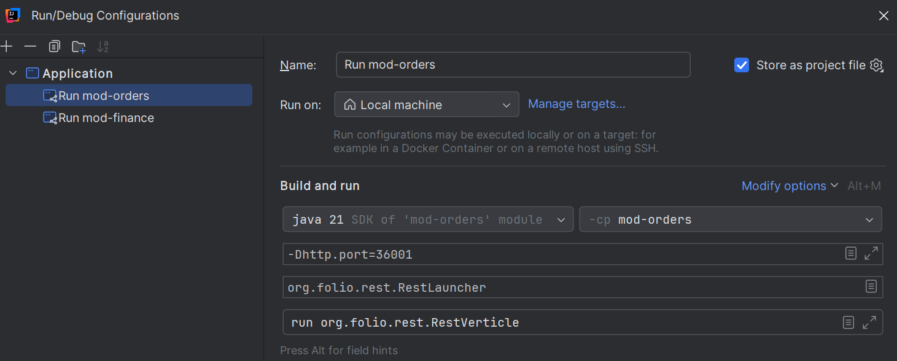
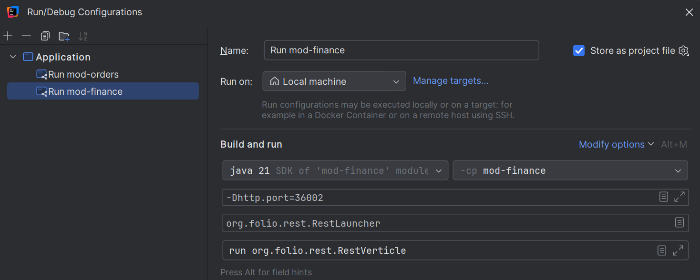

# Development guide

## Purpose

- Development commands to aid with Live Compilation, Debugger in VSCode and Module Interception in IntelliJ

## Commands

### Enable Live Compilation

- Open a new shell terminal
- `cd` into `eureka-setup/eureka-cli`
- Install `air` binary: `go install github.com/air-verse/air@latest`
- Run `air` to enable live compilation
> Will poll for code changes to recreate a binary in `./bin` folder
- See `.air.toml` for more settings on live compilation

### Enable Debugger in VSCode to analyze Eureka CLI commands

- Go to *Run And Debug* in the VSCode
- Click on *create a launch.json file*
- Select *GO* and then *GO: Launch Package*
- Replace the generated `launch.json` with the one below and save

```json
{
  "version": "0.2.0",
  "configurations": [
    {
      "name": "Eureka CLI Debugger",
      "type": "go",
      "request": "launch",
      "mode": "auto",
      "program": "${cwd}/eureka-setup/eureka-cli",
      "output": "${cwd}/eureka-setup/eureka-cli/bin/eureka-cli-debug.exe",
      "env": {
        "GOOS": "windows", 
        "GOARCH": "amd64"
      },
      "args": ["deployApplication", "-d"],
      "showLog": true,
    }
  ]
}
```

- Add breakpoints and click on *RUN AND DEBUG Start Debugging*
> Must undeploy previously deployed application before starting
- The `args` can be modified to reflect which CLI command is to be debugged, e.g. `"args": ["createUsers", "-d"]` will run `createUsers` command in the debugged mode with verbose logs

### Enable Module Interception in IntelliJ (an example for mod-orders and mod-finance)

- `cd` into `eureka-setup/eureka-cli`
- Deploy the Eureka environment using the *combined* profile: `./bin/eureka-cli -c config.combined.yaml deployApplication`
- Set `VAULT_ROOT_TOKEN` env var in `intercept/.env` with the current Vault Root Token
  - Retrieve the Vault Root Token: `./bin/eureka-cli getVaultRootToken`
- Set `SIDECAR_VERSION` env var in `intercept/.env` with the current sidecar version
  - Find the currently deployed module or sidecar versions: `./bin/eureka-cli -c config.combined.yaml listModules`
- Set `MOD_ORDERS_VERSION_SHORT` env var in `intercept/.env` with the current mod-orders version
- Set `MOD_FINANCE_VERSION_SHORT` env var in `intercept/.env` with the current mod-finance version
- Stop the existing modules: `docker container stop eureka-combined-mod-orders eureka-combined-mod-finance`
- Stop the existing sidecars: `docker container stop eureka-combined-mod-orders-sc eureka-combined-mod-finance-sc`
- Start the custom sidecars: `docker compose -f intercept/*.yaml up -d`
  - Check the status of the custom sidecars: `docker compose -f intercept/*.yaml ps -a`
- Start the module instances in IntelliJ which will communicate with other modules deployed in Eureka environment via their custom sidecars 

<table>
<caption>IntelliJ Run Configurations and Env Files</caption>
<thead>
<tr>
<th>mod-orders</th>
<th>mod-finance</th>
</tr>
</thead>
<tbody>
<tr>
<td></td>
<td></td>
</tr>
<tr>
<td>

```conf
; PostgreSQL
DB_HOST=localhost
DB_PORT=5432
DB_DATABASE=folio
DB_USERNAME=folio_rw
DB_PASSWORD=supersecret
DB_CHARSET=UTF-8
DB_MAXPOOLSIZE=50
DB_QUERYTIMEOUT=60000

; Kafka
ENV=folio
KAFKA_HOST=localhost
KAFKA_PORT=9092

; Okapi (compatible with Kong)
OKAPI_HOST=localhost
OKAPI_PORT=37001
OKAPI_SERVICE_HOST=localhost
OKAPI_SERVICE_PORT=37001
OKAPI_SERVICE_URL=http://localhost:37001
OKAPI_URL=http://localhost:37001
```

</td>
<td>

```conf
; PostgreSQL
DB_HOST=localhost
DB_PORT=5432
DB_DATABASE=folio
DB_USERNAME=folio_rw
DB_PASSWORD=supersecret
DB_CHARSET=UTF-8
DB_MAXPOOLSIZE=50
DB_QUERYTIMEOUT=60000

; Kafka
ENV=folio
KAFKA_HOST=localhost
KAFKA_PORT=9092

; Okapi (compatible with Kong)
OKAPI_HOST=localhost
OKAPI_PORT=37002
OKAPI_SERVICE_HOST=localhost
OKAPI_SERVICE_PORT=37002
OKAPI_SERVICE_URL=http://localhost:37002
OKAPI_URL=http://localhost:37002
```
</td>
</tr>
</tbody>
</table>

- Perform module healthchecks: `curl -sw "\n" --connect-timeout 3 http://localhost:36001/admin/health http://localhost:36002/admin/health`
> Expect: *"OK"*
- Perform sidecar healthchecks: `curl -sw "\n" --connect-timeout 3 http://localhost:37001/admin/health http://localhost:37002/admin/health`
> Expect: *{ "status": "UP" }*
- Finally test *mod-finance* interception by creating a *Fund Budget* in the *Finance App*
- After that, create a *Purchase Order* with a *Purchase Order Line* and an attached *Fund Distribution*, using the *Fund* created in the *Finance App*, within the *Orders App*

### Disable Module Interception

- Stop the module instances in IntelliJ
- Stop the custom sidecars: `docker compose -f intercept/*.yaml down`