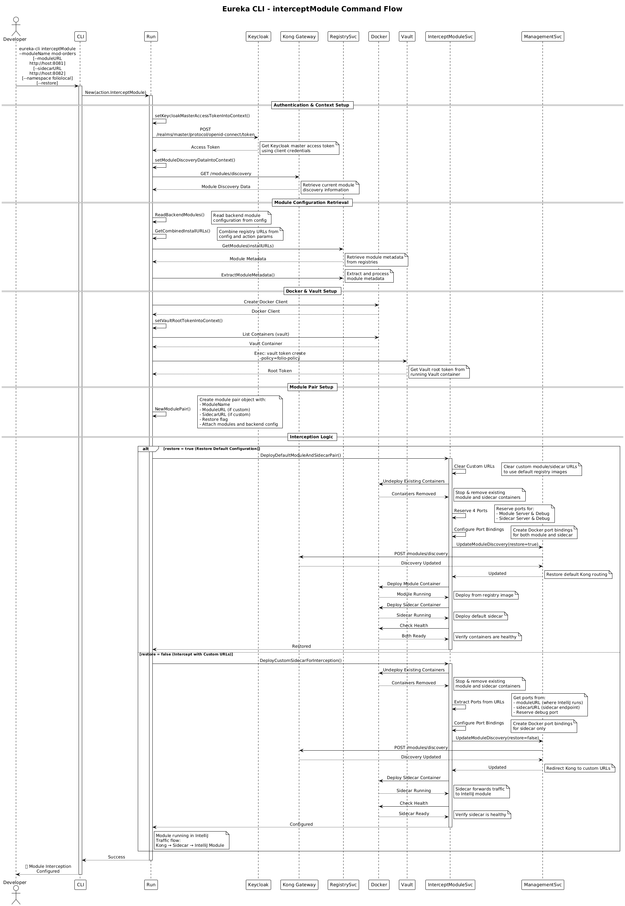
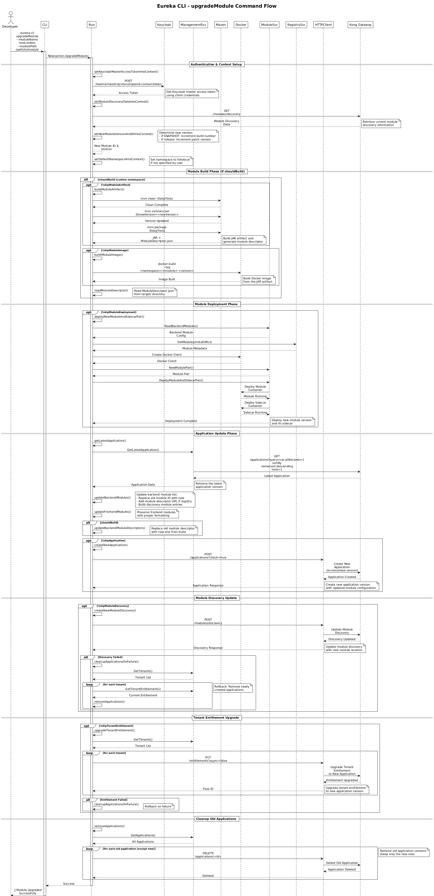

# Module Development Guide

## Table of Contents

- [Module Development Guide](#module-development-guide)
  - [Table of Contents](#table-of-contents)
  - [Purpose](#purpose)
  - [Overview](#overview)
  - [interceptModule Command](#interceptmodule-command)
    - [Purpose of interceptModule](#purpose-of-interceptmodule)
    - [How It Works](#how-it-works)
      - [1. Intercept Mode (default)](#1-intercept-mode-default)
      - [2. Restore Mode (`--restore` flag)](#2-restore-mode---restore-flag)
    - [Usage Examples](#usage-examples)
      - [Enable Interception with Custom URLs](#enable-interception-with-custom-urls)
      - [Enable Interception with Default Gateway](#enable-interception-with-default-gateway)
      - [Intercept with Different Profile](#intercept-with-different-profile)
      - [Restore Default Containers](#restore-default-containers)
      - [Restore with Custom Namespace](#restore-with-custom-namespace)
    - [Command Flow Diagram](#command-flow-diagram)
    - [Common Scenarios](#common-scenarios)
      - [Scenario 1: Debug a Single Module](#scenario-1-debug-a-single-module)
      - [Scenario 2: Intercept Multiple Modules](#scenario-2-intercept-multiple-modules)
      - [Scenario 3: Intercept After Upgrade](#scenario-3-intercept-after-upgrade)
  - [upgradeModule Command](#upgrademodule-command)
    - [Purpose of upgradeModule](#purpose-of-upgrademodule)
    - [How upgradeModule Works](#how-upgrademodule-works)
      - [Phase 1: Authentication \& Context Setup](#phase-1-authentication--context-setup)
      - [Phase 2: Module Build (if custom namespace)](#phase-2-module-build-if-custom-namespace)
      - [Phase 3: Module Deployment](#phase-3-module-deployment)
      - [Phase 4: Application Update](#phase-4-application-update)
      - [Phase 5: Module Discovery Update](#phase-5-module-discovery-update)
      - [Phase 6: Tenant Entitlement Upgrade](#phase-6-tenant-entitlement-upgrade)
      - [Phase 7: Cleanup](#phase-7-cleanup)
    - [upgradeModule Usage Examples](#upgrademodule-usage-examples)
      - [Upgrade to Next SNAPSHOT Version](#upgrade-to-next-snapshot-version)
      - [Upgrade with Specific Profile](#upgrade-with-specific-profile)
      - [Downgrade to Existing Version](#downgrade-to-existing-version)
      - [Upgrade with Custom Namespace](#upgrade-with-custom-namespace)
      - [Skip Specific Steps](#skip-specific-steps)
    - [upgradeModule Flow Diagram](#upgrademodule-flow-diagram)
    - [upgradeModule Scenarios](#upgrademodule-scenarios)
      - [Scenario 1: Upgrade to Test Local Changes](#scenario-1-upgrade-to-test-local-changes)
      - [Scenario 2: Downgrade to Previous Version](#scenario-2-downgrade-to-previous-version)
      - [Scenario 3: Upgrade Without Rebuilding](#scenario-3-upgrade-without-rebuilding)
      - [Scenario 4: Test Application Update Logic Only](#scenario-4-test-application-update-logic-only)
  - [Development Workflows](#development-workflows)
    - [Workflow 1: Debug Existing Module](#workflow-1-debug-existing-module)
    - [Workflow 2: Test Local Changes](#workflow-2-test-local-changes)
    - [Workflow 3: Upgrade and Debug](#workflow-3-upgrade-and-debug)
  - [Best Practices](#best-practices)
  - [Troubleshooting](#troubleshooting)
    - [Issue: Interception not working](#issue-interception-not-working)
    - [Issue: Upgrade fails during Maven build](#issue-upgrade-fails-during-maven-build)
    - [Issue: Module not receiving traffic after upgrade](#issue-module-not-receiving-traffic-after-upgrade)
    - [Issue: Cannot restore after intercept](#issue-cannot-restore-after-intercept)
    - [Issue: Port conflicts](#issue-port-conflicts)
    - [Issue: Namespace confusion](#issue-namespace-confusion)

## Purpose

- This guide explains how to use Eureka CLI's `interceptModule` and `upgradeModule` commands for local module development and testing workflows.

## Overview

Eureka CLI provides two powerful commands for module development:

- **`interceptModule`**: Redirects traffic from Kong to your locally running module in IntelliJ for debugging
- **`upgradeModule`**: Builds, deploys, and upgrades a module to a new version (or downgrades to an existing version)

These commands work together to provide a seamless development experience, allowing you to debug live traffic, test changes, and upgrade module versions without manual container management.

## interceptModule Command

### Purpose of interceptModule

The `interceptModule` command allows you to intercept traffic destined for a deployed FOLIO module and redirect it to your local development instance running in IntelliJ. This enables:

- **Live debugging** with breakpoints while the environment continues to run
- **Testing changes** without rebuilding Docker images
- **Hot-reloading** support for rapid iteration
- **Multiple module interception** by running multiple local instances

### How It Works

The command operates in two modes:

#### 1. Intercept Mode (default)

- Undeploys the existing module and sidecar containers
- Deploys a custom sidecar configured to forward traffic to your IntelliJ instance
- Updates Kong's module discovery to route requests through the custom sidecar
- Leaves your module running in IntelliJ to receive the traffic

#### 2. Restore Mode (`--restore` flag)

- Undeploys the custom sidecar
- Redeploys the default module and sidecar containers from the registry
- Restores Kong's module discovery to use the default routing

### Usage Examples

#### Enable Interception with Custom URLs

```bash
# Intercept mod-orders with explicit URLs
eureka-cli interceptModule \
  --moduleName mod-orders \
  --moduleURL http://host.docker.internal:36002 \
  --sidecarURL http://host.docker.internal:37002
```

#### Enable Interception with Default Gateway

```bash
# Simplified syntax using -g flag for default gateway
eureka-cli interceptModule \
  --moduleName mod-orders \
  --defaultGateway \
  --moduleUrl 36002 \
  --sidecarUrl 37002
```

#### Intercept with Different Profile

```bash
# Use import profile instead of combined
eureka-cli -p import interceptModule \
  --moduleName mod-orders \
  --defaultGateway \
  --moduleUrl 36002 \
  --sidecarUrl 37002
```

#### Restore Default Containers

```bash
# Restore mod-orders to default registry image
eureka-cli interceptModule --moduleName mod-orders --restore
```

#### Restore with Custom Namespace

```bash
# Restore but use locally built image with foliolocal namespace
eureka-cli interceptModule \
  --moduleName mod-orders \
  --restore \
  --namespace foliolocal
```

### Command Flow Diagram



**Key Steps:**

1. **Authentication & Context Setup**: Obtains Keycloak access token and retrieves current module discovery
2. **Module Configuration Retrieval**: Reads backend modules and fetches metadata from registries
3. **Docker & Vault Setup**: Creates Docker client and retrieves Vault root token
4. **Module Pair Setup**: Creates module pair object with configuration
5. **Interception Logic**:
   - **Restore Mode**: Redeploys default module and sidecar from registry
   - **Intercept Mode**: Deploys custom sidecar that forwards to IntelliJ

### Common Scenarios

#### Scenario 1: Debug a Single Module

1. Start your module in IntelliJ on port 36002
2. Run: `eureka-cli interceptModule -n mod-orders -gm 36002 -s 37002`
3. Set breakpoints and interact with the UI
4. When done: `eureka-cli interceptModule -n mod-orders -r`

#### Scenario 2: Intercept Multiple Modules

1. Start mod-orders in IntelliJ on port 36002
2. Start mod-inventory on port 36003
3. Run: `eureka-cli interceptModule -n mod-orders -gm 36002 -s 37002`
4. Run: `eureka-cli interceptModule -n mod-inventory -gm 36003 -s 37003`

#### Scenario 3: Intercept After Upgrade

1. Upgrade module: `eureka-cli upgradeModule -n mod-orders --modulePath ~/path/to/mod-orders`
2. Start upgraded code in IntelliJ on port 36002
3. Intercept: `eureka-cli interceptModule -n mod-orders -gm 36002 -s 37002`

## upgradeModule Command

### Purpose of upgradeModule

The `upgradeModule` command automates the process of upgrading (or downgrading) a FOLIO module to a specific version. It handles:

- **Version management** with automatic SNAPSHOT build number incrementing
- **Maven artifact building** with version updates
- **Docker image creation** with proper tagging
- **Container deployment** with health checks
- **Application updates** with version tracking
- **Module discovery updates** in Kong
- **Tenant entitlement upgrades** across all tenants

### How upgradeModule Works

The command follows a multi-phase workflow:

#### Phase 1: Authentication & Context Setup

- Obtains Keycloak master access token
- Retrieves current module discovery from Kong
- Determines the new module version (auto-increment or explicit)
- Sets default namespace to `foliolocal` if not specified

#### Phase 2: Module Build (if custom namespace)

- Builds Maven artifact with `mvn clean`, `versions:set`, and `package`
- Builds Docker image from the JAR artifact
- Reads module descriptor for registry metadata

#### Phase 3: Module Deployment

- Deploys new module and sidecar containers
- Performs health checks to ensure readiness

#### Phase 4: Application Update

- Retrieves latest application version
- Updates backend module list with new version
- Creates new application version (increments patch)

#### Phase 5: Module Discovery Update

- Updates Kong module discovery with new module location
- Includes rollback mechanism on failure

#### Phase 6: Tenant Entitlement Upgrade

- Upgrades entitlements for all tenants to new application version
- Includes rollback mechanism on failure

#### Phase 7: Cleanup

- Removes old application versions (keeps only the new one)

### upgradeModule Usage Examples

#### Upgrade to Next SNAPSHOT Version

```bash
# Auto-increments build number (e.g., 13.1.0-SNAPSHOT.1093 → 1094)
eureka-cli upgradeModule \
  --moduleName mod-orders \
  --modulePath ~/Folio/folio-modules/mod-orders
```

#### Upgrade with Specific Profile

```bash
# Use combined-native profile
eureka-cli -p combined-native upgradeModule \
  --moduleName mod-orders \
  --modulePath ~/Folio/folio-modules/mod-orders
```

#### Downgrade to Existing Version

```bash
# Use existing image from folioci namespace (Docker Hub)
eureka-cli upgradeModule \
  --moduleName mod-orders \
  --moduleVersion 13.1.0-SNAPSHOT.1093 \
  --namespace folioci \
  --modulePath ~/Folio/folio-modules/mod-orders
```

#### Upgrade with Custom Namespace

```bash
# Build with custom DockerHub namespace
eureka-cli upgradeModule \
  --moduleName mod-orders \
  --namespace myorg \
  --modulePath ~/Folio/folio-modules/mod-orders
```

#### Skip Specific Steps

```bash
# Skip building artifact (use existing JAR)
eureka-cli upgradeModule \
  --moduleName mod-orders \
  --modulePath ~/Folio/folio-modules/mod-orders \
  --skipModuleArtifact

# Skip building image (use existing Docker image)
eureka-cli upgradeModule \
  --moduleName mod-orders \
  --modulePath ~/Folio/folio-modules/mod-orders \
  --skipModuleImage

# Skip deployment (only update application metadata)
eureka-cli upgradeModule \
  --moduleName mod-orders \
  --modulePath ~/Folio/folio-modules/mod-orders \
  --skipModuleDeployment

# Skip all build and deployment steps (test mode)
eureka-cli upgradeModule \
  --moduleName mod-orders \
  --modulePath ~/Folio/folio-modules/mod-orders \
  --skipModuleArtifact \
  --skipModuleImage \
  --skipModuleDeployment \
  --skipApplication \
  --skipModuleDiscovery \
  --skipTenantEntitlement
```

### upgradeModule Flow Diagram



**Key Steps:**

1. **Authentication & Context Setup**: Obtains tokens, determines version, sets default namespace
2. **Module Build Phase**: Builds Maven artifact and Docker image (if custom namespace)
3. **Module Deployment Phase**: Deploys new containers with health checks
4. **Application Update Phase**: Creates new application version with updated modules
5. **Module Discovery Update**: Updates Kong routing with rollback on failure
6. **Tenant Entitlement Upgrade**: Upgrades all tenant entitlements with rollback on failure
7. **Cleanup Old Applications**: Removes old versions (keeps new one)

### upgradeModule Scenarios

#### Scenario 1: Upgrade to Test Local Changes

1. Make changes to mod-orders code
2. Run: `eureka-cli upgradeModule -n mod-orders --modulePath ~/Folio/mod-orders`
3. Test the changes in the deployed environment
4. View logs: `docker logs mod-orders`

#### Scenario 2: Downgrade to Previous Version

1. Identify the version to downgrade to (e.g., 13.1.0-SNAPSHOT.1093)
2. Run: `eureka-cli upgradeModule -n mod-orders --moduleVersion 13.1.0-SNAPSHOT.1093 --namespace folioci --modulePath ~/Folio/mod-orders`
3. Verify the downgrade in the environment

#### Scenario 3: Upgrade Without Rebuilding

1. Build JAR manually: `cd ~/Folio/mod-orders && mvn clean package`
2. Run: `eureka-cli upgradeModule -n mod-orders --modulePath ~/Folio/mod-orders --skipModuleArtifact`
3. This uses your pre-built JAR and only handles image building and deployment

#### Scenario 4: Test Application Update Logic Only

1. Run: `eureka-cli upgradeModule -n mod-orders --modulePath ~/Folio/mod-orders --skipModuleArtifact --skipModuleImage --skipModuleDeployment`
2. This skips all build/deploy steps but tests application versioning logic

## Development Workflows

### Workflow 1: Debug Existing Module

**Use Case:** You want to debug an issue in a deployed environment without changing the module version.

```bash
# Step 1: Start module in IntelliJ with correct environment variables
# Port: 36002, Debug Port: 5005

# Step 2: Enable interception
eureka-cli interceptModule -n mod-orders -gm 36002 -s 37002

# Step 3: Set breakpoints and test in UI
# Traffic now flows: Kong → Custom Sidecar → IntelliJ

# Step 4: When done, restore defaults
eureka-cli interceptModule -n mod-orders -r
```

### Workflow 2: Test Local Changes

**Use Case:** You've made code changes and want to test them in the full environment.

```bash
# Step 1: Make code changes in ~/Folio/mod-orders

# Step 2: Upgrade module (builds and deploys)
eureka-cli upgradeModule -n mod-orders --modulePath ~/Folio/mod-orders

# Step 3: Test in the deployed environment
# Module is now running with your changes

# Step 4: View logs if needed
docker logs mod-orders
```

### Workflow 3: Upgrade and Debug

**Use Case:** You want to upgrade a module and immediately debug it.

```bash
# Step 1: Upgrade module
eureka-cli upgradeModule -n mod-orders --modulePath ~/Folio/mod-orders

# Step 2: Start upgraded code in IntelliJ
# Port: 36002, Debug Port: 5005

# Step 3: Enable interception
eureka-cli interceptModule -n mod-orders -gm 36002 -s 37002

# Step 4: Debug with breakpoints

# Step 5: When done, restore to upgraded version
eureka-cli interceptModule -n mod-orders -r --namespace foliolocal
```

## Best Practices

1. **Module Naming**: Always use the correct module name as defined in backend modules configuration
2. **Port Management**: Keep track of ports used for different modules to avoid conflicts
3. **Namespace Usage**: Use `foliolocal` for local builds, `folioci` for SNAPSHOT versions, `folioorg` for releases
4. **Restore After Intercept**: Always restore default containers when done debugging
5. **Profile Selection**: Use appropriate profiles (`-p combined`, `-p import`, etc.) based on your environment
6. **Skip Flags**: Use skip flags to speed up repetitive operations (e.g., `--skipModuleArtifact` if JAR is already built)
7. **Version Control**: When downgrading, always specify the correct namespace to ensure the right image is used
8. **IntelliJ Configuration**: Ensure your IntelliJ run configuration has:
   - Correct environment variables (DB_HOST, KAFKA_HOST, etc.)
   - Correct JVM flags (debug port, memory settings)
   - Module listening on the specified port

## Troubleshooting

### Issue: Interception not working

- Verify your IntelliJ instance is running on the correct port
- Check that environment variables match the deployed environment
- Ensure the sidecar URL is correctly specified
- Review logs: `docker logs mod-orders-sc`

### Issue: Upgrade fails during Maven build

- Verify Maven is installed: `mvn --version`
- Check module path is correct
- Ensure `pom.xml` exists in the module path
- Review Maven logs for specific errors

### Issue: Module not receiving traffic after upgrade

- Check module health: `docker logs mod-orders`
- Verify module discovery: `curl http://kong.eureka:8001/modules/discovery`
- Check application version was updated
- Ensure tenant entitlements were upgraded

### Issue: Cannot restore after intercept

- Try specifying namespace explicitly: `--namespace folioci` or `--namespace foliolocal`
- Check if module image exists: `docker images | grep mod-orders`
- Review Docker logs: `docker logs mod-orders`

### Issue: Port conflicts

- Check what's running on the port: `lsof -i :36002` (macOS/Linux) or `netstat -ano | findstr :36002` (Windows)
- Use different ports for different modules
- Ensure IntelliJ instances use unique ports

### Issue: Namespace confusion

- `foliolocal`: Used for locally built images via `upgradeModule`
- `folioci`: SNAPSHOT versions from Docker Hub
- `folioorg`: Released versions from Docker Hub
- Always specify namespace when downgrading: `--namespace folioci`

For more help, check the main [README.md](../README.md) or open an issue on GitHub.
